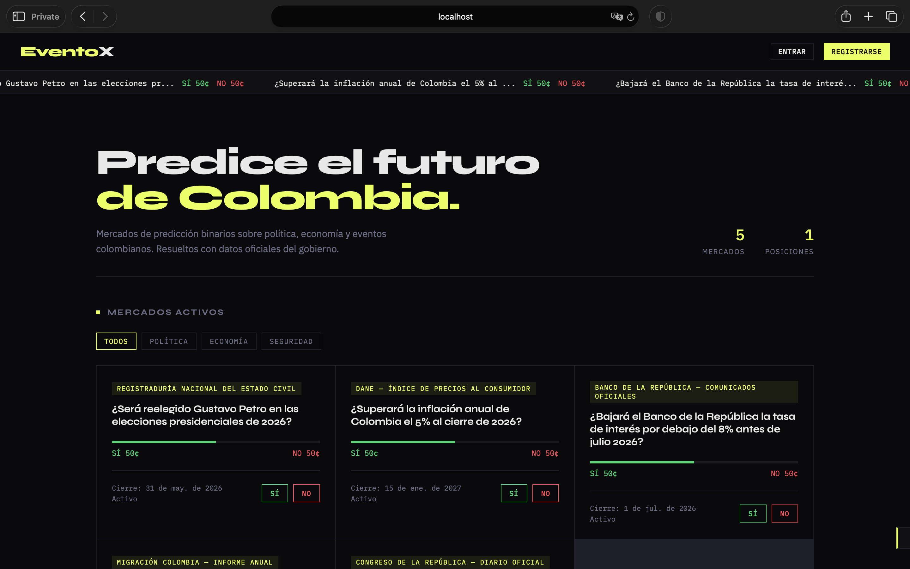

# EventoX

**A binary prediction market platform for Colombian real-world events.**

Users stake play-money credits on YES/NO outcomes tied to politics, economics, and public policy. Markets resolve based on official Colombian government data sources (DANE, Registraduría Nacional, Superintendencia Financiera). Every feature is live — no login required.

**[→ Try the live demo](https://eventox-production.up.railway.app)**

---



---

## What makes this technically interesting

This is a full-stack prediction market with a real financial model — not a CRUD app dressed up as one.

- **Dynamic pricing engine** — every bet shifts the market price (1¢ per 100 credits). YES buys push the YES price up; NO buys push it down. YES + NO always sum to 100¢, maintaining the market invariant.
- **Entry-price-aware payouts** — winners receive `stake × 100 / entry_price`, not a flat 2×. A bet placed at 30¢ pays out more than one placed at 70¢, rewarding early conviction.
- **Atomic transactions** — bet placement, position selling, and market resolution all run inside `BEGIN / COMMIT / ROLLBACK` blocks with row-level locking to prevent double-spend and race conditions.
- **Market lifecycle scheduler** — a 5-minute interval process opens upcoming markets (and emails subscribers), auto-closes markets past their deadline, and escalates unresolved markets to `overdue` status after 24 h.
- **Intent signals analytics** — pre-bet actions (clicking YES/NO before committing) are tracked per market and IP, surfaced in the admin panel to understand user intent before position volume.
- **Daily bonus race condition prevention** — the cooldown check is an atomic `UPDATE … WHERE last_daily_bonus <= NOW() - INTERVAL '24 hours'`, not a read-then-write that would be vulnerable to concurrent requests.

---

## Feature set

| Area | Features |
|---|---|
| **Markets** | Create YES/NO binary markets with categories, resolution sources, close times, and images |
| **Pricing** | Dynamic AMM-style price engine; sparkline price history charts (Chart.js) |
| **Positions** | Buy YES/NO at live price; sell partial or full position before resolution; entry-price PnL tracking |
| **Portfolio** | Open positions with unrealized PnL; closed history with realized PnL; position stats dashboard |
| **Resolution** | Admin resolves market; winning positions pay out at entry-price multiplier; losing positions close |
| **Scheduler** | Auto-opens upcoming markets; auto-closes past deadline; escalates unresolved to `overdue` |
| **Credits** | 1,000 starting credits; daily 200-credit bonus (24 h atomic cooldown); admin credit gifting |
| **Leaderboard** | Top 20 users by credit balance |
| **Upcoming markets** | Preview cards for not-yet-open markets; email notification on open |
| **Analytics** | Intent signals (pre-bet click tracking) per market, grouped in admin panel |
| **Images** | Cloudinary upload/storage for market cover images; admin image editing modal |
| **UI/UX** | Dark/light mode toggle; live price ticker; countdown timers; market detail modal with price chart |
| **Security** | Helmet security headers; CORS whitelist; rate limiting (general, bets, uploads, analytics); atomic bonus |
| **Demo mode** | No login required — fully open, shared demo user, all features accessible |

---

## Tech stack

| Layer | Choice | Why |
|---|---|---|
| Runtime | Node.js 18 | Familiar, well-supported on Railway |
| Framework | Express.js | Minimal overhead; easy to reason about for a monolith |
| Database | PostgreSQL | Proper transaction semantics; CHECK / FK constraints; needed for the atomic bonus fix |
| Frontend | Vanilla HTML/CSS/JS | Zero build step; one file; fast to iterate at MVP scale |
| Image storage | Cloudinary | Persistent CDN storage; avoids disk/ephemeral filesystem issues on Railway |
| Email | Nodemailer + Gmail | Market-open notifications to subscribers |
| Security | Helmet + express-rate-limit | Security headers and request throttling |
| Deploy | Railway | Single-command deploys from `main`; managed PostgreSQL |

---

## Architecture

```
┌──────────────────────────────────────────────────────────┐
│                      Browser (SPA)                        │
│                                                          │
│  Market cards · Price bars · Bet modal · Sell modal      │
│  Portfolio dashboard · Admin panel · Price history chart  │
│  Ticker · Countdown timers · Toast notifications          │
└─────────────────────────┬────────────────────────────────┘
                          │  fetch() — JSON REST API
                          ▼
┌──────────────────────────────────────────────────────────┐
│                  Express Server (server.js)               │
│                                                          │
│  Middleware stack:                                        │
│    CORS whitelist → Helmet headers → Rate limiters        │
│    → useDemoUser (injects shared user) → route handler   │
│                                                          │
│  Route groups:                                            │
│    /events     — market CRUD + resolution + scheduler     │
│    /bets       — position buy / sell (transactional)      │
│    /credits    — daily bonus (atomic UPDATE)              │
│    /leaderboard, /stats, /markets/hot                    │
│    /admin      — resolve, gift credits, intent signals    │
│    /analytics  — intent signal ingestion                  │
│    /auth/demo  — shared demo user endpoint               │
│                                                          │
│  Background scheduler (setInterval 5 min):               │
│    opens upcoming → closes past deadline → marks overdue  │
└─────────────────────────┬────────────────────────────────┘
                          │  pg (node-postgres)
                          ▼
┌──────────────────────────────────────────────────────────┐
│                     PostgreSQL                            │
│                                                          │
│  users              — credits, last_daily_bonus           │
│  events             — markets, prices, status lifecycle   │
│  bets               — positions with entry_price + PnL    │
│  transactions       — full audit log of all credit moves  │
│  price_history      — time-series for chart rendering     │
│  market_notifications — subscriber list for open-alerts  │
│  intent_signals     — pre-bet click tracking              │
└──────────────────────────────────────────────────────────┘
                          │
        ┌─────────────────┴──────────────────┐
        ▼                                    ▼
┌───────────────┐                  ┌─────────────────┐
│   Cloudinary  │                  │  Gmail (SMTP)   │
│               │                  │                 │
│ Market cover  │                  │ Market-open     │
│ images (CDN)  │                  │ email alerts    │
└───────────────┘                  └─────────────────┘
```

---

## Database schema

```sql
-- Market definitions and lifecycle
CREATE TABLE events (
  id                SERIAL PRIMARY KEY,
  title             TEXT NOT NULL,
  description       TEXT,
  category          TEXT DEFAULT 'politics',
  status            TEXT DEFAULT 'open',    -- upcoming|open|closed|overdue|resolved
  outcome           TEXT,                   -- yes|no (set on resolution)
  resolved          BOOLEAN DEFAULT FALSE,
  yes_price         INTEGER DEFAULT 50,     -- 0–100; yes_price + no_price = 100
  no_price          INTEGER DEFAULT 50,
  resolution_source TEXT,
  close_time        TIMESTAMP,
  opens_at          TIMESTAMP,              -- for upcoming markets
  image_url         TEXT,
  watch_count       INTEGER DEFAULT 0,
  closed_at         TIMESTAMP,
  created_at        TIMESTAMP DEFAULT NOW()
);

-- User accounts and credit balances
CREATE TABLE users (
  id               SERIAL PRIMARY KEY,
  username         TEXT UNIQUE NOT NULL,
  email            TEXT UNIQUE NOT NULL,
  password_hash    TEXT NOT NULL,
  credits          INTEGER DEFAULT 1000,
  is_admin         BOOLEAN DEFAULT FALSE,
  last_daily_bonus TIMESTAMP,
  created_at       TIMESTAMP DEFAULT NOW()
);

-- Open and closed positions
CREATE TABLE bets (
  id          SERIAL PRIMARY KEY,
  event_id    INTEGER REFERENCES events(id),
  user_id     INTEGER REFERENCES users(id),
  position    TEXT NOT NULL CHECK (position IN ('yes', 'no')),
  amount      INTEGER NOT NULL,
  entry_price INTEGER NOT NULL,             -- price at time of purchase
  status      TEXT DEFAULT 'OPEN',         -- OPEN|CLOSED
  pnl         INTEGER,                     -- realized on close/resolution
  created_at  TIMESTAMP DEFAULT NOW()
);

-- Full credit audit trail
CREATE TABLE transactions (
  id          SERIAL PRIMARY KEY,
  user_id     INTEGER REFERENCES users(id),
  event_id    INTEGER REFERENCES events(id),
  type        TEXT NOT NULL,               -- bet_placed|sell|winnings|loss|daily_bonus
  amount      INTEGER NOT NULL,
  description TEXT,
  created_at  TIMESTAMP DEFAULT NOW()
);

-- Time-series price data for charts
CREATE TABLE price_history (
  id          SERIAL PRIMARY KEY,
  event_id    INTEGER REFERENCES events(id) ON DELETE CASCADE,
  yes_price   INTEGER NOT NULL,
  no_price    INTEGER NOT NULL,
  recorded_at TIMESTAMP DEFAULT NOW()
);

-- Market open notification subscriptions
CREATE TABLE market_notifications (
  user_id  INTEGER REFERENCES users(id),
  event_id INTEGER REFERENCES events(id),
  notified BOOLEAN DEFAULT FALSE,
  PRIMARY KEY (user_id, event_id)
);

-- Pre-bet intent tracking
CREATE TABLE intent_signals (
  id         SERIAL PRIMARY KEY,
  event_id   INTEGER REFERENCES events(id) ON DELETE SET NULL,
  action     TEXT NOT NULL,
  ip         TEXT,
  created_at TIMESTAMP DEFAULT NOW()
);
```

---

## API reference

### Health & stats

| Method | Endpoint | Description |
|---|---|---|
| `GET` | `/health` | Server status |
| `GET` | `/health/db` | Database connectivity |
| `GET` | `/stats` | Market and position counts |

### Auth (demo mode)

| Method | Endpoint | Description |
|---|---|---|
| `GET` | `/auth/demo` | Returns the shared demo user (no credentials needed) |

### Markets

| Method | Endpoint | Description |
|---|---|---|
| `GET` | `/events` | All non-upcoming markets |
| `GET` | `/events/upcoming` | Upcoming markets |
| `POST` | `/events` | Create a market |
| `POST` | `/events/:id/resolve` | Resolve YES/NO; settles all open positions |
| `PATCH` | `/events/:id/image` | Update market cover image |
| `POST` | `/events/:id/notify` | Subscribe to market-open email alert |
| `POST` | `/events/:id/watch` | Increment watch count |
| `GET` | `/events/:id/watching` | Get watch count |
| `GET` | `/events/:id/price-history` | Time-series YES price for chart |
| `GET` | `/markets/hot` | Top 3 markets by bet volume in last 24 h |

### Positions

| Method | Endpoint | Description |
|---|---|---|
| `POST` | `/bets` | Buy YES/NO at current market price |
| `POST` | `/bets/:id/sell` | Sell all or part of an open position |
| `GET` | `/bets/mine` | All positions for current user |

### Credits & leaderboard

| Method | Endpoint | Description |
|---|---|---|
| `POST` | `/credits/daily` | Claim 200-credit daily bonus (24 h cooldown) |
| `POST` | `/admin/gift-credits` | Gift credits to a user by username |
| `GET` | `/leaderboard` | Top 20 users by credit balance |
| `GET` | `/transactions/mine` | Last 50 credit transactions for current user |

### Analytics & admin

| Method | Endpoint | Description |
|---|---|---|
| `POST` | `/analytics/intent` | Log a pre-bet intent signal |
| `GET` | `/admin/intent-signals` | Aggregated intent signals by market and action |
| `POST` | `/admin/upload-image` | Upload image to Cloudinary, returns URL |

---

## Running locally

### Prerequisites

- Node.js 18+
- PostgreSQL 14+

### Setup

```bash
git clone https://github.com/luis-lacruz/eventox.git
cd eventox/backend
npm install
```

Create the database and run the schema:

```bash
createdb eventox
psql eventox < db/setup.sql
psql eventox < db/migration_transactions.sql
psql eventox < db/migration_price_history.sql
psql eventox < db/migration_bets_entry_price.sql
```

Configure environment:

```bash
cp .env.example .env
# Fill in DATABASE_URL, CLOUDINARY_*, EMAIL_USER, EMAIL_PASS, APP_URL
```

Start the server:

```bash
node server.js
# → http://localhost:3000
```

---

## Key design decisions

**No framework on the frontend.** The entire UI is a single `index.html` — no build step, no bundler, no framework. At this scale it means faster iteration and one less layer between intent and output. The tradeoff is no component reuse across pages, which doesn't matter with one page.

**Dynamic AMM-style pricing, not an order book.** A real order book needs counterparties and liquidity. An AMM-style impact function (`±1¢ per 100 credits`) gives every bet immediate price feedback and makes the market always tradeable — which matters for a small-user MVP where thin order books would stall.

**Entry-price-aware payouts.** Flat 2× payouts ignore when you bought. Paying out `stake × 100 / entry_price` means a bet at 30¢ and one at 70¢ on the same outcome have different risk/reward profiles — closer to how prediction markets actually work.

**PostgreSQL transactions everywhere.** Bet placement, selling, and resolution each touch multiple rows across multiple tables. Wrapping them in `BEGIN/COMMIT` with `ROLLBACK` on error means partial state is impossible — either the whole trade happens or nothing does.

**Atomic bonus cooldown.** The daily bonus uses a single `UPDATE … WHERE last_daily_bonus <= NOW() - INTERVAL '24 hours'` instead of a read-then-write. This eliminates the race window where two concurrent requests could both read "not yet claimed" before either writes — no locking needed.

**Monolith over microservices.** At MVP scale, network hops between services add latency and operational complexity without benefit. Everything runs in one Express process; the code is structured by route group so splitting is straightforward if volume justifies it.

---

## Roadmap

- [x] Express server + PostgreSQL integration
- [x] Binary market creation and lifecycle (upcoming → open → closed → resolved)
- [x] Dynamic pricing engine (AMM-style, entry-price aware)
- [x] Position buy / sell with real-time PnL
- [x] Atomic market resolution with per-position payouts
- [x] Portfolio dashboard with unrealized + realized PnL stats
- [x] Daily bonus with atomic race-condition prevention
- [x] Leaderboard — top predictors by credit balance
- [x] Admin panel — create, resolve, image-edit markets; gift credits
- [x] Intent signals analytics — pre-bet click tracking
- [x] Price history time-series + sparkline charts (Chart.js)
- [x] Market lifecycle scheduler (5-min interval: opens, closes, escalates)
- [x] Email notifications on market open (Nodemailer)
- [x] Cloudinary image upload/management
- [x] Light / dark mode toggle with localStorage persistence
- [x] Live price ticker + countdown timers
- [x] Security hardening (Helmet, CORS whitelist, rate limiting, input validation)
- [x] Open demo mode — no login required, all features accessible
- [ ] WebSocket live price updates (currently polling at 30 s)
- [ ] Mobile-responsive layout
- [ ] Shareable market URLs with og:meta for social previews

---

## Context

EventoX is a binary prediction market — not a betting platform. It's designed as a civic engagement tool where users forecast real-world Colombian events using play money. All market resolutions are tied to official, publicly verifiable government data sources.

---

## Author

**Luis S. Lacruz**  
[GitHub](https://github.com/luis-lacruz) · [LinkedIn](https://linkedin.com/in/luis-lacruz)
